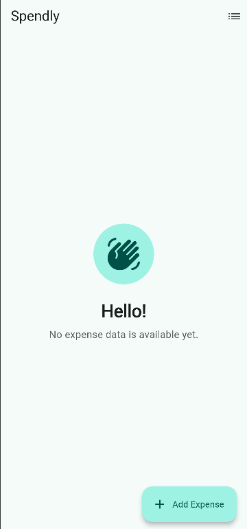
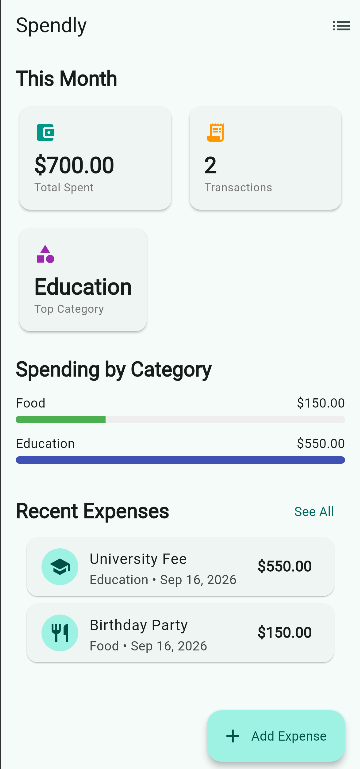
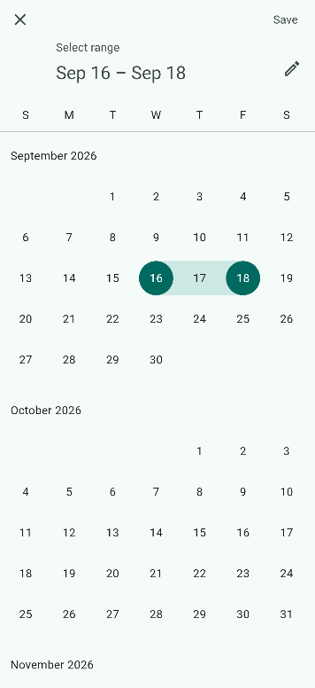

# Spendly 💰

[](https://flutter.dev)
[](https://dart.dev)
[](https://pub.dev/packages/bloc_signals)
[](#supported-platforms)
[](LICENSE)

**Spendly** is a modern, cross-platform personal expense tracking application built with **Flutter** and reactive **Signals-based state management** (`bloc_signals_flutter` & `signals_flutter`). It features an offline-first storage architecture backed by **SQLite** (`sqflite`), real-time computed analytics, and an intuitive Material 3 user interface.

---

## 🌟 Key Features

- 📊 **Dashboard Overview**: Real-time spending summary including total monthly expenses, transaction counts, top spending category, and category-wise percentage breakdown.
- 🔍 **Advanced Filtering & Search**: Instant real-time search by description/category, quick category chips filter, and flexible date-range picker filters.
- ✏️ **Complete Expense Management (CRUD)**: Easily add, view, edit, and delete expenses with input validation, date picking, and category assignment.
- ⚡ **Reactive Signals Engine**: Powered by `CubitSignal` and fine-grained computed signals for automated UI re-evaluation without unnecessary widget re-renders.
- 🛡️ **Resilient Cross-Platform Storage**:
  - Offline-first local database via **SQLite** (`sqflite` on Mobile/Desktop).
  - Automated WebAssembly SQLite support (`sqflite_common_ffi_web` on Web).
  - Graceful, zero-crash fallback to in-memory persistence when database initialization is constrained.
- 👋 **User Onboarding & Empty States**: Clean greeting view ("Hello!") directing new users to create their first expense entry when no data is present.

---

## 📱 Screenshots & User Experience
     

| Empty Onboarding | Dashboard Overview | Category Breakdown | Filter & Search |
| :---: | :---: | :---: | :---: |
| Welcome greeting guiding first-time expense entry | Monthly totals, recent transactions & quick actions | Interactive category spending visualizer | Search query, category chips & date range filters |

---

## 🏗️ Architecture & Technical Design

Spendly follows **Clean Architecture** principles and a **Feature-First** package layout for clean separation of concerns, testability, and scalability.

```
lib/
├── app.dart                             # App root with BlocSignalProvider & MaterialApp theme
├── main.dart                            # Cross-platform entry point with database initialization
├── core/                                # Core utilities and global constants
└── features/
    └── expenses/                        # Expense feature module
        ├── data/
        │   └── expense_repository.dart  # Sqflite & InMemory repository implementations
        ├── domain/
        │   └── entities/
        │       ├── expense.dart          # Core Expense entity model & JSON/SQLite mappers
        │       └── expense_category.dart # Category enum with display names, icons, & colors
        └── presentation/
            ├── cubits/
            │   ├── expense_cubit.dart    # CubitSignal managing commands & computed signals
            │   └── expense_state.dart    # Equatable immutable state class
            ├── screens/
            │   ├── add_expense_screen.dart   # Screen wrapper for creating/editing expenses
            │   ├── dashboard_screen.dart     # Primary home dashboard with error & empty states
            │   └── expense_list_screen.dart  # Screen for listing, searching & filtering expenses
            └── widgets/
                ├── category_breakdown.dart # Spending breakdown bar chart
                ├── dashboard_summary.dart  # Monthly summary analytics cards
                ├── expense_form.dart       # Form widget with validation & category picker
                ├── expense_list_item.dart  # ListTile widget for single expense item
                └── recent_expense_list.dart# Recent transactions list with empty state card
```

### State Management: Signals + Cubit
Spendly uses **`CubitSignal`** (`bloc_signals_flutter`), combining the structure of BLoC/Cubit with the efficiency of Signals:
- **`stateValue`**: Immutable `ExpenseState` holds raw expense lists, search query, category filters, and date boundaries.
- **Computed Signals**: Fine-grained reactive values (`filteredExpenses`, `monthlyTotalCents`, `categoryTotals`, `topCategory`, `transactionCount`) automatically re-evaluate only when relevant dependencies update.
- **`BlocSignalBuilder` & `BlocSignalListener`**: Granular UI updates and non-intrusive side-effect handling (e.g. error SnackBars).

---

## 🛠️ Tech Stack & Dependencies

| Dependency | Purpose |
| :--- | :--- |
| **[Flutter SDK](https://flutter.dev)** | Cross-platform UI framework (Dart 3+) |
| **[bloc_signals_flutter](https://pub.dev/packages/bloc_signals_flutter)** | Signals-integrated state management for Flutter |
| **[signals_flutter](https://pub.dev/packages/signals_flutter)** | Core reactive signals and computed values |
| **[sqflite](https://pub.dev/packages/sqflite)** | SQLite plugin for iOS and Android |
| **[sqflite_common_ffi](https://pub.dev/packages/sqflite_common_ffi)** | SQLite FFI implementation for Windows, macOS, and Linux |
| **[sqflite_common_ffi_web](https://pub.dev/packages/sqflite_common_ffi_web)** | WebAssembly SQLite implementation for Flutter Web |
| **[equatable](https://pub.dev/packages/equatable)** | Value-equality for state comparison |
| **[intl](https://pub.dev/packages/intl)** | Currency and date formatting |
| **[uuid](https://pub.dev/packages/uuid)** | Unique ID generation for expense records |

---

## 🚀 Getting Started

### Prerequisites
- **Flutter SDK**: `^3.12.2` or later
- **Dart SDK**: `^3.12.2` or later
- IDE: **Android Studio**, **VS Code**, or **IntelliJ IDEA** with Flutter extensions installed.

### Installation

1. **Clone the Repository**:
   ```bash
   git clone https://github.com/your-username/spendly.git
   cd spendly
   ```

2. **Install Dependencies**:
   ```bash
   flutter pub get
   ```

3. **Verify Environment Setup**:
   ```bash
   flutter doctor
   ```

---

## 💻 Running the Application

Spendly runs seamlessly across Mobile, Desktop, and Web platforms:

### Mobile (Android & iOS)
```bash
# Run on connected Android device / emulator
flutter run -d android

# Run on iOS simulator (macOS required)
flutter run -d iphone
```

### Desktop (Windows, macOS, Linux)
```bash
# Windows
flutter run -d windows

# macOS
flutter run -d macos

# Linux
flutter run -d linux
```

### Web
```bash
flutter run -d chrome
```

---

## 🧪 Testing & Quality Control

To run unit and widget tests:

```bash
# Run all unit and widget tests
flutter test

# Run tests with coverage report
flutter test --coverage
```

To run static analysis:
```bash
flutter analyze
```

---

## 🌐 Supported Platforms

- 🤖 **Android** (API Level 21+)
- 🍏 **iOS** (iOS 12.0+)
- 🖥️ **Windows** (Windows 10+)
- 🍎 **macOS** (macOS 10.14+)
- 🐧 **Linux** (Ubuntu/Debian)
- 🌐 **Web** (Chrome, Safari, Firefox, Edge)

---

## 📄 License

This project is licensed under the MIT License - see the [LICENSE](LICENSE) file for details.
